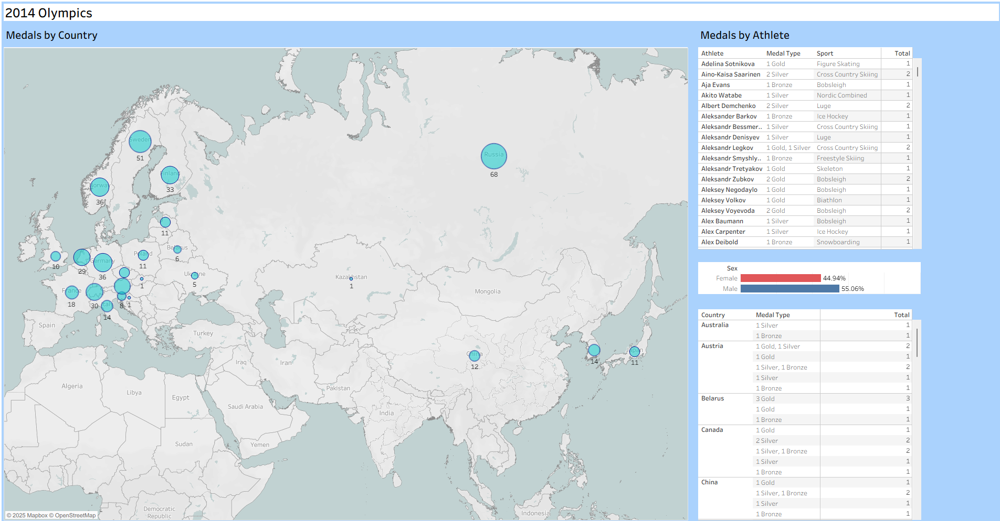

# 🥇 2014 Winter Olympics — Interactive Tableau Dashboard

An interactive **Tableau dashboard** visualizing *medal results from the **2014 Winter Olympics**.
The dashboard combines multiple visual components — a **symbol map**, **athlete details table**, **sex ratio bars**, and **country medal summary** — into one cohesive, dynamic interface.

## 🎯 Overview

This project explores the medal distribution of the **2014 Winter Olympics** using **Tableau Actions** (*Filter*, *Highlight*, *Go to URL* - Actions).
Users can explore data by **country**, **athlete**, and **sex**, and instantly filter across views by interacting with the map.

**Key questions explored:**

- Which countries won the most medals?

- Which athletes contributed to those results?

- What is the sex distribution among medal winners?

## 🧭 Features

## 🌍 Symbol Map:
Displays the total medals earned by each country. The **bubble size** represents total medals.
Clicking a bubble filters the other charts automatically.

## 👤 Athlete Table:
Lists every medal-winning athlete along with their medal type and sport.
Each athlete name includes a clickable **Wikipedia link (in tooltip)** for quick reference.

## ⚧ Sex Ratio Bar:
Shows the percentage of **male vs. female** medalists — dynamically updates based on the selected country.

## 🏆 Country Medal Summary:
A detailed breakdown showing medal counts by **country** and **medal type** (Gold, Silver, Bronze).

## 🖼️ Preview

## 💾 How to Use  

1. Download the `.twbx` file included in this repository.  
2. Open it in **Tableau Public** (free version available at [public.tableau.com](https://www.tableau.com/community/public)).  
3. Interact with the bubbles and Athlete Names to explore the dasboard yourself.

## 💬 Summary

This project demonstrates:
- Ability to create **interactive, multi-view Tableau dashboards**.  
- Use of **actions, filters, and tooltips** for a seamless exploration experience.  
- **Clean visual design** and **clear storytelling**.

## ⚙️ Data
**Source**: Training Dataset (2014 Winter Olympics) from Cenit College
